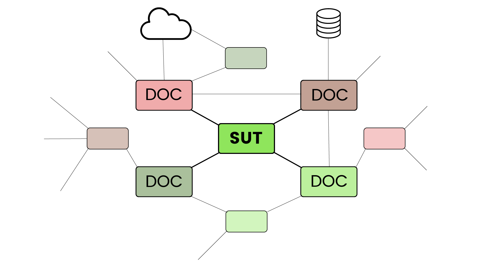
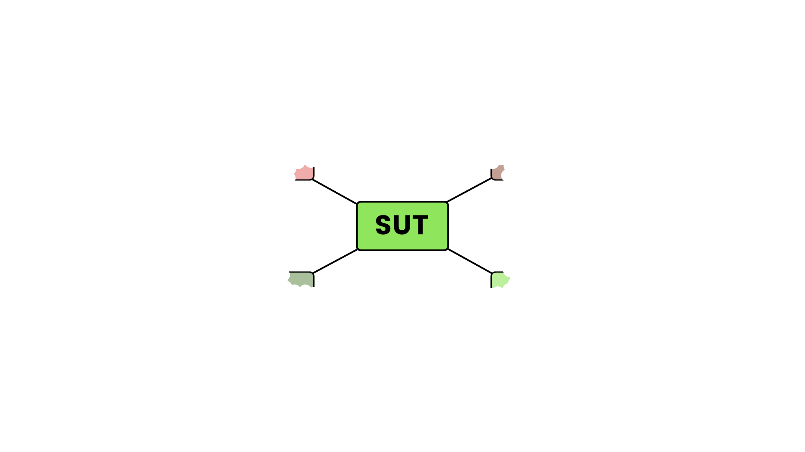
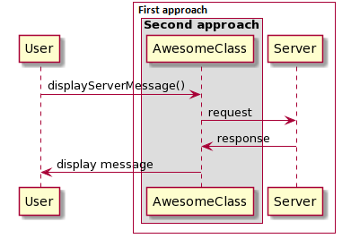

# Basics of software testing

## Introduction

A few decades ago the way developers tested their code was that they wrote a new piece of code, and manually tried whether it does what it should do. If yes, they were happy and integrated it to their software. It was *tested*. So the software only contained tested and well functioning code. Right?

Well... not quite.

There are multiple problems with it:

* **Software is complex** - if you change something in your code, it will cause errors in totally other places - and multiple places in unexpected ways. So if you add code, you need to retest the other parts as well, which worked before, to make sure your new change did not break them. It means that all pieces of code need to be tested again and again.
* **Code is never done** - if you finish a piece of code, you know in the future you will extend, change, fix it. You will refactor it, find bugs, and the requirements will change. So it's not true that you test something once and it will work together.
* **No one knows what you did** - if you test something casually and manually, you will not document what requirements you validated. Did you check the edge cases? The happy and failing paths? The security issues? What are the exact requirements?

We could continue this list, but the point is that software testing became a separate profession with its own vocabulary, tools and best practices. This document tries to explain the basic concepts of software testing.

### What is testing

Testing for short is checking software against requirements.

You can consider writing tests as writing down the requirements in the language of the code. Like instead of having them in English in a doc, you have them in C++ (or whatever language you use), so the machine can check whether your code fulfills it or not.

(*Note:* in case of manual testing it can be actually a document in English. There are also automated test framework, like [Robot](https://robotframework.org/) or [FitNesse](http://fitnesse.org/FitNesse.UserGuide) which let you write higher level tests in not strictly in programming languages. Of course these are also tests, but in this document we don't concentrate on them.)

So you write your own code (the *production code*) and parallelly you write your test code in the same language, which is just additional software. This test code uses your production code and decides whether it does what it should do. How exactly? This document is all about that.

Every test must be a requirement you should be able to explain it to someone in a human language as well.

There is a pretty boring tutorial generally about testing in case you want to read more details: [Software Testing Tutorial](https://www.tutorialspoint.com/software_testing/index.htm)

### No exhaustive testing

**Exhaustive testing** means *all* mathematically possible input combinations are tested, and *all* possible potential bugs are revealed. There is a theorem in [ISTQB](https://www.istqb.org/) (International Software Testing Qualifications Board) material which says that such an exhaustive test can *never* exist. This is not a mathematical theorem, it's more like a rule of thumb, but it is a really strong statement, and everyone who does software testing should be aware of the fact that exhaustive testing is practically impossible.

**Example**: you develop a web based application. Users can log in and there are different user roles which control rights, for example Admin, Contributor and Subscriber. Also you can set 100ish rights separately by checking checkboxes for every user on admin interface.

Let's say you add a new feature "Bulk delete blogposts". You add a right setting "Bulk delete blogposts" to the admin interface so admins can decide who can bulk delete blogposts. The ones with this box checked should be able to bulk delete and vica versa, regardless of their actual user role. But checking user roles can enable/disable this box.

What should you test? Well to simplify it you can check if you log in as a user who doesn't have this right and try to bulk delete, you don't manage. And then if you are logged in as a user who has the box checked in, *can*. But is it enough? Should you check these for every user role? You can say no, because the requirement is that the feature should be dependent only on the checkbox and not user roles. But how do you prove that user role does not affect the feature accidentally? You can also say requirement is that it should work for all user roles. So maybe it's a good idea to check it with every user role. But isn't it a requirement that it should not be affected by all the other rights? If you have 100 rights, how many combinations you can have? Can you physically prove that it works for all of them? What about *all* the other settings in the system? State of the database? Time dependent features? It is possible to write code which makes the bulk deletion feature dependent on those things, so it's physically possible to have those bugs. But it's impossible to test everything. Use your common sense, but be thourough.

### Why is testing important

Testing can slow down development process, therefore it is sometimes can be viewed as time-consuming and expensive activity.

But the experience shows that the price (even in time or in money or in complexity) of finding and fixing a bug grows exponentially during the life cycle of the product. This means that a bug costs the most, when found by the customer in the already released product, and it is significantly cheaper to fix it during testing phase. But it is even cheaper (waaay lot cheaper) if we can catch it during development time. To be short: the earlier we catch the problem, the better. And there is a huuuge difference.
(Some sources: [CrossBrowserTesting: What’s the True Cost of a Software Bug?](https://crossbrowsertesting.com/blog/development/software-bug-cost/), 
[synopsys: How much do bugs cost to fix during each phase of the SDLC?](https://www.synopsys.com/blogs/software-security/cost-to-fix-bugs-during-each-sdlc-phase/), [The Celerity Blog: The True Cost of a Software Bug: Part One](http://blog.celerity.com/the-true-cost-of-a-software-bug))

### It's not just important, it's very important. It's necessary

Having tests can bring us advantages we don't even thing in advance. I will add a few thought about that.

Having automated tests instead of manual first seems like doing the same thing faster. It is true in some sense, but having them faster enables us *to do different things* and not just do the same thins faster. This quantitative difference becomes a qualitative difference and we start working in a totally different way which has more advantages than we often expect.

It is a generally accepted fact that code rots. However you start with the code it will become tangled, hard to read. Fixing bugs and adding new features become extreme slow and expensive. And not just slow and expensive, but dangeour as well, because when you change something, you can never know what you break and you introduce bugs which are, again, slow and expensive and introduce new bugs. Etc.

It's very important that code has **implementation** and **behaviour**. Behaviour is what the user can see, it's what I can show to my mom. Implementation is how the code is structured, what technical solutions are chosen. The same behaviour can be implemented in thousands of different ways. And there are good ways and bad ways.

In order to avoid code rot and not end up in a state where you are simply too afraid to make changes, we need to refactor. Whole [Clean Code](https://www.amazon.com/Clean-Code-Handbook-Software-Craftsmanship/dp/0132350882) book and [Design Patterns](https://www.adlibris.com/se/bok/design-patterns-9780201633610?gclid=Cj0KCQjwnqH7BRDdARIsACTSAduUcTgb8yFs09Q0S50DSLr-7XMnJxH72vC3Y16wu9vrHXuuTFIxziIaAgfaEALw_wcB) are about how to structure your code. There are plenty other books as well (I really suggest [this one](https://www.adlibris.com/se/bok/head-first-design-patterns-9780596007126?gclid=Cj0KCQjwnqH7BRDdARIsACTSAduXELZdo7796rD1iY4WXUWziuZveC74bcnI-4hLnEeDmS6lAqrkSJoaAv74EALw_wcB) on Design Patterns).

But how do you structure your code and not break it? You need to change the implementation while maintaining the behaviour. This is called **refactoring**. How do you make sure you don't change behaviour? Well you need to have tests in place which phrase the requirements and can check them and can be run in a rather short period of time (several times a day). If you have it, you are safe to make changes and if you run them often, you will always know which one of your changes caused the error and it will be much quicker to fix it. And the main advantage: you are not afraid to change the code and tidy it up from time to time. It will be much faster and cheaper to make changes, because you can keep your code structured. And you will have less bugs anyway, because you catch them early.

Every change can break behaviour, so stop thinking in **tested** and start thinking in **covered**. You should have the possibility to run the tests and verify behaviour *any time* and quickly.

Michael C. Feathers in his book [Working Effectively with Legacy Code](https://www.amazon.com/Clean-Code-Handbook-Software-Craftsmanship/dp/0132350882/ref=pd_lpo_14_t_1/143-8887909-2708226?_encoding=UTF8&pd_rd_i=0132350882&pd_rd_r=31cd39a8-5751-410e-a608-adb246fb80f5&pd_rd_w=jhuv0&pd_rd_wg=SbQsE&pf_rd_p=7b36d496-f366-4631-94d3-61b87b52511b&pf_rd_r=8RT0EFQVQX6YGVN0PMPE&psc=1&refRID=8RT0EFQVQX6YGVN0PMPE) described tests as a Software Vise. A vise is the tool carpentes use to have the working piece fixed in one position when working with it. This is how tests can fix the behaviour in one place while you change the implementation.

.

Tests can be considered as working with a safety net. I think of them as climbing the ladder with two hands instead of one. When you change something, you let the safe and working state go and move to an unknown and dangerous new situation, like when you release the ladder with your hand to climb higher. But if you have the tests unchanged, you are still holding on it with your other hand so you won't fall.

Feathers described two ways of working as *Edit and Pray*, when you edit a code part, assume where it can cause bugs and test those parts once and pray that you won't break anything else. This is *testing for correctness*, where the point of the tests are to show that the new feature you added is correct.

The other (and better) way is *Cover and Modify*, is that you have a safety net of well covered automated tests so you can work in safe and modify your code with confidence. This is *testing to detect change* in behaviour.

With the Edit and Pray method you can get by for a while but your code becomes unsustainable and eventually fixing bugs will eat up all your capacity and your customers will leave you.

### I already have my code in place and it's untested, what do I do?

It's a hard question. There is code which is easy to test and code which is hard or impossible to test. If you write new code you can write it together with tests or at least keep in mind to write testable code. But often you have to work with legacy code which is written in a way it seems impossible to be tested.

I suggest you the book I mentioned: [Working Effectively with Legacy Code](https://www.amazon.com/Clean-Code-Handbook-Software-Craftsmanship/dp/0132350882/ref=pd_lpo_14_t_1/143-8887909-2708226?_encoding=UTF8&pd_rd_i=0132350882&pd_rd_r=31cd39a8-5751-410e-a608-adb246fb80f5&pd_rd_w=jhuv0&pd_rd_wg=SbQsE&pf_rd_p=7b36d496-f366-4631-94d3-61b87b52511b&pf_rd_r=8RT0EFQVQX6YGVN0PMPE&psc=1&refRID=8RT0EFQVQX6YGVN0PMPE) from Michael C. Feathers. It contains very concrete techniques and tools how to work with the nasty code where you think there is no hope. But these are far out of the scope of this document. [Refactoring : Improving the Design of Existing Code
](https://www.bookdepository.com/Refactoring-Martin-Fowler/9780134757599?redirected=true&utm_medium=Google&utm_campaign=Base1&utm_source=SE&utm_content=Refactoring&selectCurrency=SEK&w=AF7YAU99ZB14Y7A8VCXH&gclid=Cj0KCQjwnqH7BRDdARIsACTSAdvC2WS5NdT0J0JMDzCfm-_sPqI7PbbULjPWh-N24u_p7by6gzj-aZAaAg7hEALw_wcB) from Martin Fowler can be also a help.

### Cost to Find and Fix Issues

So if you think that you can win an hour, a day, or even a few days by not testing something, keep in mind that it can cause weeks for you or someone else later.

And as we said, we will probably not find all of the bugs, we have to find as many as possible, and as soon as possible.

.

The above picture is from Martin Fowler's article [Is High Quality Software Worth the Cost?](https://martinfowler.com/articles/is-quality-worth-cost.html). It shows that if you don't test your code you start faster. In the beginning you create more functionality under a specified time. But later, when your code becomes more complex you will spend much more time by finding and fixing bugs then by actual development.

If you test your code well, you will start slower (because you invest time in writing tests as well, not only the production code), but later you won't slow down that much. After a time this will return, so it's worth to write tests, although it seems slower at the beginning. How fast it will return? According to Fowler (and I gighly agree with him) as fast as in a few weeks. So writing tests is actually not that long term investment.

The same applies to other quality practices, for example Clean Code.

It's only worth to skip testing if your software is developed for weeks only and is used only a few times. (Like to quickly calculate something.) These are called the quick-and-dirty programs.

### Tested is not equal to good

Although testing is extremely important, you should always know that no testing method is omnipotent. Even if you write test for every requirement, and your code fulfills them, it doesn't mean that your code is *good*.

* Keep in mind that probably you wrote the tests for the code which is also written by you. (You test your own code.) Maybe you misunderstood the requirements and requirements should have been written in a different way.
* Maybe the customer or whoever ordered the software or wrote the specification was unsure or wrong. 
* Maybe your code fulfills the requirements, but is unusable by the user, or unreadable and unextendable by other developers.

Different testing practices along with comprehensive review should be applied together, and even if code passes all, common sense must be used.

### Other things

A lot of other stuff can find - if you want - at [ISTQB Glossary](https://glossary.istqb.org/en/search/), like what is the definition of a bug, and a fault, and an incident, and what is the difference between them. And a lot more...

## Testing types

Testing is a whole separate profession, and there are a lot of different types of tests, and there are different approaches to categorize them. We tried to shortly collect and introduce the most important terms.

### Manual testing

This is when - what a surprise - the tester or the developer tests the system without the help of any automation tools. Usually this happens, when there is no automation framework, or when the situation is so unique that there is no standard way of testing it, like a very new feature or a mysterious bug. This usually does not happen regularly, it is one-time or few-times event.

The drawback of it is that it's really slow and expensive. The advantage is that it's much more flexible, and able to find tricky bugs as well. It is also closer to the end user's behavior.

### Automatic testing

Automatic tests are run by scripts, usually scheduled, triggered by time (e.g. daily) or an event (like commit or merge to a branch). Of course it needs more software, so the work of professional testers is much more similar to the developers.

### CI - Continuous Integration

Automatic testing makes the process faster. But this is not the only advantage. A common best practice is to shorten the development phases. For example if you develop a feature for half a year and then merge the whole thing all at once to the master branch, a lot of issues can emerge. If you release a big change to the customers, a lot of business and technicl assumptions are verified at once.

But if you develop little pieces of features and merge and release them more often (often daily of multiple times a day) you have much less opportunity to make mistakes and you also have a much faster feedback loop (about your test results and also about what the customers think). But this approach needs very good automated testing machinery, which runs tests, static checkers (formatting, linting, memory leak protections, etc.) fast and automated. The goal is to continuously integrate the newly developed features to the product. That's why this practice is called Continuous Integration.

This ensures that bugs can be caught early, and in case there is a problem, only a small part of code is suspected. The fixes will be cheaper and faster, and much less code will exist untested "under the radar" at any point of time.

This approach also goes well with the agile principles, like scrum, which says you should rather do a little of everything continuously instead of having long periods of only one thing.

CI helped a lot of companies to change business model, and it made it possible to have frequent updates on your mobile apps, and also to view software as a continuous living flow and not some monolits released in every two years.

### Black-Box vs. White-Box testing

#### Black-Box testing

Black-Box testing is when you don't know or don't care about the internal parts of the tested code. Technically saying, you test against the interface. This is good, because you test from the user's perspective, and it forces you to test the actual requirements and not how you imagine your code should work.

Of course, technically it is more complicated, because you have limited access to the code, and sometimes it is important or reasonable to see some detail of a piece of code.

An advantage of Black-Box testing is that you have the freedom to change the implementation details without ruining the already written testcases.

#### White-Box testing

You have full knowledge and access to the implementation details of the code. It gives you more control, and less worries about tricky test implementations. It can lead to too strict tests though, where you set requirements against implementation details, which could have been written any other way. In this case, you have less freedom to change the code.

**Example**: white-box test can check the private variables in a class change, while a black-box test can only use the interface. Or in higher level tests a white box test can verify how the database is changes in a webapplication, while black-box test can have requirements only against what the user can see and don't care about how it's solved in the background. For example if you need to test an image upload feature a white-box test can verify that it is on the server in a specified folder. A black-box test should go where the user go on the GUI to see where they uploaded the picture.

In my opinion you should use the black-box approach whenever possible, because 1) this is how the requirements are actually phrased (no user will ask you to save a picture in a specified folder on your server) and 2) leaves you more freedom to change implementation and keep the behaviour (if you change the directory where you save the images it can make a white-box test fail, while the user sees the feature unchanged). But sometimes it's impossible or just unfeasable to make end-to-end black box tests and that's when you use the white-box tests and reveal the guts of your implementation. For example it's very hard to test the e-mail or sms sending feature in a local environment. To be short, white-box tests check **implementation** and black-box tests verify **behaviour**.

Note that this is also context dependent: a unit test of a class can be black-box, but from the system's perspective it is requirements against implementation. Deciding whether a test is black/white box needs clear definition of what system/subsystem you are testing at the moment.

### Grey-Box testing

Mixture of the two, when you have some knowledge (access) to the code in the test, but not everything.

## Testing levels

There are a lot of different levels (or types?) of tests. Developers meet only with unit tests and module tests 99% of the time.

### Unit testing

The most important test type for a developer. [Unit testing](https://en.wikipedia.org/wiki/Unit_testing) is when you test the smallest testable part (the unit) of the software. A unit does not have a strict definition. Usually this is a function, method, or sometimes a class. Since a unit should be the undividable "atom" of the code, no interactions are tested in unit tests. The purpose of the unit test is to ensure every building block is working as intended.

Although it is not set in stone, unit tests are the only tests, which are always written by the developer, simultaneously with the production code.

A unit test should

* Be as simple as possible, preferably not more than a few lines of code
* test only 1 well defined functionality - should have only 1 reason to fail
* be fast. There will be hundreds of unit tests, and in good case, you will run them very frequently, even in every few minutes. All tests should run in a few seconds.
* phrase a piece of requirement. If someone unfamiliar with the code reads through the unit tests (or preferably only the names of the tests) should understand the purpose of the tested unit

*Note*: if you commit code, it should always be submitted together with the unit tests. They should never be separated or handled independently, and you don't have to emphasize for a commit that it also includes unit tests, because that is always mandatory part anyway.

*Note2*: Feathers in his book mentions that a test is not a unit test if:
* it talks to a database
* it communicates across a network
* it touches the file system
* you have to do extra steps in your environment (like configuration or edit files) in order to run them.

A unit test should be extremely fast so you can run *all* your unit tests in a few minutes at worst. Or maybe a subset in every few minutes and all of them in every half an hour. And this can mean thousands of unit tests. If they run slow, it disencourages the programmer to run them. Slow tests end up being not run. If you think it's impossible to run your tests fast because of unbreakable dependencies, believe me: *it's possible*, but not easy.

#### The F.I.R.S.T. principles

This abbreviation they often mention describes how unit test should be:

* **Fast** - it has to encourage the developer to run all the tests as often as possible, preferably after every few lines of code change, or every few minutes. Therefore they have to run in a few seconds.
* **Isolated/Independent** - the result of a test mustn't change the result of another test. Also their order shouldn't matter. If you need to run a test first in order to make another one pass, you are doing it wrong. All of them should set up and use their own variables.
* **Repeatable** - they must be deterministic. If a test passes/fails, it has to give the same result if you run it again.
* **Self-validating** - every test must have a true/false result. If you need to read through logs or manually check the result and decide whether it passes or fails, you are doing it wrong. Testing frameworks help with it and can understand what the results of a test is.
* **Thorough** - should cover all happy paths, edge cases (at the border of good/bad input), illegal arguments, security issues, too large values, etc.

#### Unit testing frameworks

There are either built in or 3rd party frameworks for practically all languages, such as Jtest for Java, unittest for Python. C++ has limited built in functionalities to help unit testing, but there is an open source 3rd party framework provided by Google, called [Google Test](https://github.com/google/googletest). PHP uses PHPUnit. Golang has a builtin unit testing framework which can be extended by libraries to be more useful.

These frameworks help to write tests easier, also automatically identify and group unit test, run them and evaluate their result and give feedback. In some less advanced frameworks you have a separate file where you list all your tests. But with some frameworks you don't need to do that. If you use the correct folder structure and naming conventions (e.g. prefixing your test functions with `test_`) the framework will find all of them in your project automatically. This is called automatic test discovery.

### Module testing

Module testing's definition can be more flexible. A module can be a library, or a set of classes. The point is that module test tests the interaction of a set of units, but it's still not the test of the whole product. This is the "next step" after unit testing. Similar, with a bit bigger scope.

Since all the units are already tested, and should work individually, block tests usually fail when the units don't interact the right way.

Imagine that you have to test a lamp of a car. Unit test are the following:
1) test that the lightbulb works when is under voltage (and vica versa)
2) the battery has votlage
3) the wires transfer electricity

If all of these are true, they can still fail as a system, for example because the lightbulb and the battery are not designed for the same voltage. Module tests are to validate these kind of interactions. It validates that if you put together already tested and workin units, they still work together as a system. After module tests pass, you can consider the "module" as a working block of your software.

### Other types

There are lot of other testing practices, developers don't have to work on a day-to-day basis. They often overlap. We still introduce the most important ones though.

#### Exploratory testing

Act of manual testing, when the tester tries to challenge the system in a quite unrestricted way. It is very intuitive, but needs a good knowledge of the system and an experienced and talented tester to be done well.

#### Integration testing

The act, when already tested small parts are put together, and tested on a higher level progressively. Starting with unit tests, and continuing with module (block) tests is an important part of a well-done integration testing. Integration testing is simply the idea of stepping upper and upper on this ladder. [Wikipedia](https://en.wikipedia.org/wiki/Integration_testing) says: "Integration testing is the phase in software testing in which individual software modules are combined and tested as a group."

Since all elements were tested individually integration test verifies whether the functioning parts interact in the correct way and work well as system.

You can also view integration tests as integrating new (separately tested) funtionality to the existing software and verify they don't break each other.

#### Functional testing

Done on a complete system, strictly based on the required functionality. This is always black-box testing, end-to-end test including the whole system and phrased on a level you can discuss with your clients / users. They answer to the question whether the system functions in a way it is intended.

Since you don't need to know the details of the implementation in order to write functional test cases they can be defined by clients/managers/designers, any non-programmer who has a good knowledge of the system.

#### System testing

System is tested thoroughly as a whole, often by a specialized team. If integration testing starts with unit tests system test is the final step. The difference between Functional tests and System tests is Functional tests are verifications and System tests are validations.

* Verification: Are we building the product right?
* Validation: Are we building the right product?

#### Regression testing

It is a widely accepted fact that a change in a part of a software effects totally other parts of the software, often in an unexpected way. This means if you tested some parts (units, modules) and they passed, you cannot rest, because newly added changes can break them. Regression testing means re-running all of the previously passed tests when a new change is added, ensuring that the already working parts are not broken by the new feature.

This also needs very good (and fast) test automation machinery and thorough unit- and module tests.

Regression testing is maybe the most important reason to have automated tests as this is how you have your safety net I mentioned earlier. Well build regression tests eliminate the fear of change and enable your code to improve or at least maintain quality and not rot.

#### Acceptance testing

This will decide whether the final product complies the original requirements (and a pre written scenarios).

#### Alpha testing

Acceptance testing of the "almost done" product on the developer's site by the company.

#### Beta testing

Acceptance test outside of the developer's site, by external parties, like a limited set of potential real end-users.

## Testing approaches

### TDD - Test Driven Develpment

[Test Driven Development, or TDD for short](https://en.wikipedia.org/wiki/Test-driven_development) is related to [Extreme Programming](https://en.wikipedia.org/wiki/Extreme_programming). It takes the principle of testing as early as possible, and puts it to the extreme: write the test before the code itself.

It has 3 steps which you should repeat:

1) **Write a failing unit test**. Write only 1 test for only to one new small functionality. It will fail of course, because there is no code to fulfill it.
2) **Write to code to make the test pass**. ONLY write code to make the test pass. In TDD you write tests primarily, and you only write code because you have a failing test. Never write more or think in advance.
3) **Refactor**. Now you can refactor your code as long as you don't ruin any of your tests.


It can be very strange at first, but it has a lot of supporters. The arguments for it:

* It is guaranteed that you will have 100% (or very close) coverage.
* You will have working and tested code in every few minutes. You don't fly blind.
* You will never have unnecessary code. You don't try to write a good code and later check for the requirements. You write code directly against the requirements.
* A very good (and maybe overly idealized) example of TDD is the bowling game example. It is written down [here](http://butunclebob.com/ArticleS.UncleBob.TheBowlingGameKata). This is maybe long and boring, but there are a lot of blogposts and video captures about it. We encourage you to google around with the term "bowling game" or "bowling game TDD"!

### BDD - Behaviour Driven Develpment

After TDD, a lot of "X"DD ("'something' Driven Development") emerged. The most well-known is BDD, the [Behaviour Driven Development](https://en.wikipedia.org/wiki/Behavior-driven_development).

BDD is not an alternative to TDD or unit testing, it rather completes them, and gives advices how to write the tests.

The general principle of BDD is that you should phrase your requirements (== tests) in higher level, and you should set expectations against the behavior, and not the implementation. This should create a common language between people who write the code and people who define requirements.

#### The given-when-then approach

The main practical advice of BDD is the [Given-When-Then principle](https://martinfowler.com/bliki/GivenWhenThen.html).

It says that when you design a test scenario, you should build it around these 3 keypoints:

1) **Given**. The given part describes the state of the world before you begin the behavior you're specifying in this scenario. You can think of it as the pre-conditions to the test.
2) **When**. The when section is that behavior that you're specifying. This is the input, or the trigger.
3) **Then**. Finally the then section describes the changes you expect due to the specified behavior. This is the output, or expected result, the triggered event.

A good practice is to reflect these in the name of the test. For example `given`

In the tests, these are mapped to: given == pre-conditions, when == action, then == expectations. In most testing frameworks, they come exactly in this order, but it can be different as well.

### Others

There other <X>DD "something" Driven Development techniques, but we don't need them. You can use Google if you are courious.

## Measurements

### Coverage

You can measure how well did you write your tests in some ways, one is the [different types of coverages](https://en.wikipedia.org/wiki/Code_coverage).

#### Line coverage

Means how many percent of the lines of the production code have been executed when you run all of the test cases. Reaching 100% is the dream, but it is usually unreasonable. You can set a certain coverage level as a requirement to merge code. Uncovered code can mean missing unit test, but - if the tests are written well - it can also detect unneeded dead code as well.

What happens if I don't have good coverage? First you should understand the *exact* requirements against your code. Is something missing? What does the uncovered code do? It can give you **a hint that you forgot to write a test**. Then write that test too.

But maybe it's not the case. Maybe all of your requirements are already phrased as tests and you still have uncovered code. It means that **code is not needed to fulfill the requirements and should be removed for simplicity**.

It is also **a good way to find dead code** which is physically impossible to run (like having an if statement and right before it setting the condition to false). But sometimes it's not the case, the code is simply doing something which is not strictly needed but for some reason someone found it a good idea to implement.

Good coverage is also important in case of interpreted languages. If you code in C++ you are lucky, because the compiler cathes you many errors. But in some other languages like Python, PHP or JavaScript there is no compilation phase and a lot of errors, like a wrong variable type in a function parameter can be only caught runtime. If you actually run your code in all realistic scenarios you will catch those errors at development time even if you don't have compiler. Of courese you need to have good testcases. **Good test coverage can catch errors in interpreted languages otherwise the compiler would catch**.

But what if I *do* have a good coverage? It's important that even if you have 100% test coverage you can have untested scenarios.

For example if the happy path runs a function from the beginning to the end, your happy path test will provide you 100% coverage. But you can still have requirements for the cases your code throws an exception in the middle of that function.

Or if you have 10 independent if blocks after each other the execution can run them in 1024 different combinations. If you have a test where all 10 of the conditions are true, you will have 100% line coverage, while you tested 1 scenario and didn't test 1023.

Therefore line coverage should be used as a necessary, but not supplementary contidion. Not having good coverage is bad, but having good coverage is not enough.

You should also think of **nontrivial branching points**. The simplest is the one I mentioned a few lines above: if you have an if, but there is no else branch, that is also a case to test. Testing only true case will give you perfect coverage, but you should think of what happens if you jump over that if statement. But there are even less trivial things. In which points you can get an exception? In which points can an interrupt come in? They are all ways your code can be executed in different ways and even if you don't cover evey physical possibility you should think of them and use your common sense to identify most important cases to test.

#### Others

Exactly because of these problems they introduced other types of coverages. For example branch coverage measures how many of the possible paths have been tested, like the 1024 cases in the above example.

You can measure how many of the possible brances, functions, files, conditions have been tried out during run of unit tests. (Or module tests or others.) You can read more in the mentioned [Wikipedia article](https://en.wikipedia.org/wiki/Code_coverage). You can set different requiements for diffenent coverages in your CI system. If you don't work in a green field project, you can gradually add tests and increase the limit so you will never go below a certain number again.

Uncovered code means that you are unable to detect the breaking of this code when adding new functionality, and also that the requirements of these code parts are not defined in the test code, and they are maybe hard to understand or unneeded.

But as in the case of the line coverage none of them is omnipotent, and none of them should be used as the only goal or the only measurement.

There are automated tools to measure coverage, and usually they generate a nice html output where you can see color coded which parts of your code are not covered. Test coverages (most often line coverage) can be used in CI to block a pull request from merging if the coverage is below a certain limit.

## Practical stuff

### Separate the SUT (System under test) from the dependencies (DOC)

Some tests, like system tests, functional tests and acceptance tests need to be done on the whole real system (with a fake database maybe), but lower level tests, like unit and module testing needs separation in order to run correctly. If you write a new function or a class you need to test it without all the rest of the code.

We would like to test a specific part of code, called **System Under Test** (SUT). It can be a function or a class in case of unit tests, or modules, libraries, software blocks in case of module tests. The SUT is what you are testing right now.

Every entity has inputs and outputs. During testing, we need to ensure that the entity gives the right output for a specific input.

In the code, there is always a set of parts (functions, classes, interfaces, software units, blocks, etc.) interacting with each other. How can we pull out the entity (like a class) from the surroundings, when it relies on a lot of other classes, and those other classes also need a lot of other classes t work? The classes, or whatever pieces of software the SUT is dependent on are called **Depended-On Component** (DOC). (Definition from xUnit.) 



Example: you want to test a controller class, but it uses a model class inside, so to be able to run your controller you need to use the model as well. But the model uses underlying datastructures, which need to be included too, and a lot of helper classes for example to convert images. Then, and this is quite a big problem, your model is trying to communicate with the database. Not speaking about all of the classes your classes inherit from. So now that you wanted to test your controller separately suddenly you need to bring up kind of the whole system with a fully functioning database connection. Right?

Wrong! We just pick the SUT, and not any real classes around it. The point is that we need some simplified substitutes instead of the DOC-s, which have the same interface towards our SUT, but are not dependent on any other classes. With simpler words in the above example you use your real controller (because that's what you want to test), but a fake model which looks like the real one, but doesn't use other classes and a dabatase connection in the background. It just have the same interface towards the SUT, but returns predefined values for function calls instead of reading them from the DB.



These substitutes can be called **stubs**, **fakes** or **mocks**. We will return to these soon.

The interaction of classes in a real code can be propagated forever. The whole product is coherent in some way.

When testing a class (SUT), only its surrounding is simulated, without their dependencies.

How can we achieve this? Differently in every language.

The point is that you can dynamically provide which dependency your SUT uses. For example you have a `Room` and a `RoomMock` class. In the real code your `RoomController` uses the `Room`, but when testing it has to use the `RoomMock`.

If you use a strongly typed object oriented language the `Room` and `RoomMock` can both implement a `RoomInterface`, but in other languages, like Python or PHP it's enough that they have the same public methods and data members.

But how do I do the code use the real dependencies in production code and the mocks in test code, while my class needs to be exactly the same? There are multiple ways. A simple one is to pass the dependency to the class via constructor arguments or a setter function. With this you can provide the real dependency in production and just use the mock in test. This principle is called [Dependency Injection](https://en.wikipedia.org/wiki/Dependency_injection).

If that is not possible (for example you test a class written earlier, not having tests in mind and creating dependency hard coded inline the constructor) you still have some hopes. There are things called **seam**s. Feathers describe them in his book Working Effectively with Legacy Code. The point of a seam is that whenever your code finds a function call the interpreter/precompiler/linker/compiler has a way to find it, and if you understand how your language works you can kind of hijack it. You can hack the path variable so the linker will link the mock instead of the real class and have different compilation settings for test and production. You can use precompiler directives, or just subclass your class and override a method and use the child class in tests. Describing these techniques are outside the scope of this document, but there *are* techniques to substitute dependencies with mocks/fakes/stubs.

When writing a new class, which is public, and can be used by others, you should always provide stub or mock implementation to it as well in the test/export (or corresponding) folder.

#### What is a stub?

**Stub** is an overly simplified version of a class. It has the minimal number of methods, which are required by the header/interface/place of usage, and they usually have only one line: return a hard-coded value. A stub is usually the minimal code which satisfies the compiler check.

#### What is a fake?

**Fake** is a bit more complicated stub. It can implement some logic, but with shortcuts to not have dependencies. For example instead of communicating with a database, it uses a predefined data structure. It can have setters and getters where it will actually remember what you have set and return that value in a getter for example. Can behave different ways in different situations, but still a simplified version of the DOC class.

In reality we are usually sloppy, and use the word "stub" to stubs and fakes as well.

#### What is a mock?

In tests you use **assertions**. An assertion is any requirement which can be true or false. If any of the assertions of a testcase is false, the case fails. If none of them fails, the testcase passes. Assertions are the jurys of the testcase.

We can have a testcase like this (pseudocode):

```
test_addNumbersReturnsTheCorrectSum() {
	int a = 3;
	int b = 5;
	int expectedResult = 8;
	int result = addNumbers(a, b);
	assertEqual(result, expectedResult);
}
```

In this example it was easy to check the assertions, because the function we tested gave it back to the external world.

Although in most cases we need to inspect how the SUT communicates with *other classes*. For example: our brand new class needs to raise an alarm when the destructor is called. There is an alarm handling framework, which contains a class called `AlarmHandler` with a `raiseAlarm()` method. You need to call that method. Of course the `AlarmHandler` communicates with a lot of other classes and GUI elements and registers the alarm in a database.

How do we check it? We cannot raise a real alarm, and cannot use the framework for raising alarms, because it would bring a lot of dependencies and complexity to our simple test. So we have to have something similar to a stub for the "alarm raising framework". But we also need to check whether the `raiseAlarm()` function of it has been called or not. Our stub has to be intelligent enough to indicate to the testing framework that a specific function of it has been called, or not, and make the test fail if not. With other words it needs to make internal assertions. It's a stub which is not only there to passively help but is a judge itself who can make the test fail if not satisfied. Testing frameworks provide these kind of "intelligent stubs", called mocks. So mock is a simplified substitute of a dependency with internal assertions.

Our example would look something like this (with dependency injection):

```
test_alarmIsRaisedWhenKeepAliveClassIsDestructed {
	// Given (precondition)
	AlarmHandler alarmHandlerMock = new AlarmHandlerMock();
	KeepAlive keepAliveUnderTest = new KeepAlive(alarmHandlerMock); // here is where we injected the dependency to KeepAlive

	// Then (expectation)
	expectCall(alarmHandlerMock, raiseAlarm); // This pushes an expectation to an internal queue

	// When (action)
	del keepAliveUnderTest; // If this line makes the raiseAlarm called it gets popped from the expectation queue

	alarmHandlerMock.checkIfSatisfied(); // Some frameworks do it automatically at the end of the test, but the mock needs to know whether all of the expectations have been satisfied. If the expectation queue is not empty there are unsatisfied expectations.
}
```

You usually don't need to implement the logic of mocks, they are often provided by testing frameworks or supplementary libraries.

There can be different types of mocks, that check whether the methos has been called with specific arguments or *any* arguments, in a specific order or any order. There can be optional function calls expected or a function call can be expected an arbitrary number of times. For details see the documentation of the mocking framework you use.

#### Where do mocks come from?

(Here and later sometimes I use the work "mock" for all mocks, stubs and fakes too. Also when I write "mocking" it can mean the act of creating a mock, a stub or a fake and use it to substitute a real class.)

So when you test your class, function, module it is usually surrounded by mocks, stubs and fakes. Of course it means extra work, because you need to create mock for practically every class in the system. It's one practice to create a mock whenever you create a new class, so it can be used later when testing *other* parts of the code.

For example if I create a new class called `FinanceReport` which has dependencies and talks to the database, I also create `FinanceReportMock` to the folder where we store mocks. `FinanceReportMock` will not use real classes from the system and will not talk to the database or network so it can be used in isolation and runs very fast, but implements the same interface to the outside world as `FinanceReport`.

Later, when someone else in the future writes a class, called `FinanceReportController` which *uses* `FinanceReport` they can just use `FinanceReportMock` in the test of `FinanceReportController`.

Always remember to update the interface of `FinanceReportMock` when you change the interface of the real `FinanceReport` so they always look the same. If the language supports interfaces, it's better if the real class and it's mock implements the interface (or have some common abstract parent) and everyone else uses the interface and not the concrete classes.

#### Other helpers

Apart from mocks, stubs and fakes there are often other things, just like helper functions, setups and teardowns, [drivers](https://www.tutorialspoint.com/software_testing_dictionary/test_driver.htm) which surround your systems under test and support testing. All these code together is called the **test harness**.

Using these all the time sounds complicated, but trust me, it will make your life much simpler and development faster.

### Do I need to mock every dependency? Can't I just use real classes in tests?

No, you don't and yes, you can. Sometimes. You don't have to mock *everything*. There is no straight line, it is usually common sense, but you can keep some rules in mind:

* Mocking (and stubbing and faking) is to resolve dependency issues, and make expectations. If you don't have problems with dependencies and you have no expectations, (and it doesn't make your tests slower) it's OK to use the real one.
* Usually when the class is in the same abstraction level as the SUT, it is stubbed or mocked (they are "next to each other"). But if the class is contained by the SUT (is "inside it"), the real one often can be used, because it will not continue the dependency chain. Also, in this case this other class can be considered as the inside working of SUT (like a subcontractor). We often say, that you don't mock the builtin classes of the language like string, because you consider that already tested. If your own, already tested utility class is inside the SUT, just use the real one. But remember, nothing is set in stone! Follow your common sense!
* Only use real class if it has been tested in an earlier phase, so it can be considered trustable. Otherwise if the test fails, you don't know if your currently tested class broke it or the one you included. Never rely on "equally new" classes in your test. You should rather mock them.

### Organizing tests

Tests are organized to groups so it's easier to find them, to understand what they do and importantly so you can execute a subset of them, which, for example are testing the same class or function. How you physically organize your test files can vary from framework to framework, from language to language or can be dependent on your own team's conventions. However some vocabulary is common and you can hear people say **test case**, **test suite**, **test fixture**, **test harness** and such things.

#### What is a test case?

The wide-spread terminology, (and official ISTQB terminology) accepts **test case** as one specific test: one single set of prerequisites, expectations and actions. In some frameworks the vocabulary can be different and confusing. Usually technically a test is a function or method in the test framework.

#### What is a test suite?

According to ISTQB a **test suite** is a *set of test cases* that belong together in some way and are usually executed together. Grouping can be any logical rule, like they are testing the same method, and/or they start from the same state of the system (same prerequisites, or same "given"s). Test suites have names as well and make tests easier to manage by creating a hierarchical system. (Sometimes suites are grouped to bigger suites and so on to form this hieararchical structure.)

**Example:** for example you have an input field on a html form which by JavaScript does some calculation and updates a number with the result somewhere else in a div. The field accepts only zero and positive numbers until 100. You write unittests to test with negative number input, -1 (these should give error message), 0 (edge cases), 1, some arbitrary positive numbers and 100 (these should give correct calculation results), 101 and bigger numbers (error message), text inputs, float inputs, huge numbers, and leaving the field empty. ALso you check what happens when you change the value from a valid number to another valid number. Is the calculation updated correctly? What if you update from valid to invalid or vica versa? You can maybe think of some other cases as well. These are a lot of simple testcases all testing the same feature, the same inputfield. You can group them to a test suite and run them together by one click or command to see the input field works as intended.

*Nitpicking note*: "test suite" is often pronounced wrong. It should be pronounced similar to *sweet* and not like *suit*. (Note that "suit" and "suite" are not the same word.)

*Note 2*: this vocabulary can be different in different contexts. For example Google's C++ testing framework GTEST uses the term TestCase to the concept we described here as test suite and uses Test to the concept we described here as test case. Confusing. Always check what you should use in your context.

#### What is a test fixture?

[Test fixture](https://en.wikipedia.org/wiki/Test_fixture) is a test suite, which can have it's own state, by having own data members, and helper methods as well. Test fixture is often technically a class which contains test methods, and other helper stuff. These members are usually the SUT, the stubs and the mocks.

If multiple tests use the same set of mocks, they are grouped together in a test fixture, so you have to define them only once and concentrate on the expectations and actions in the tests.

Often test fixture and test suite is used interchangably, but actually there is difference. Sometimes I will call text fixtures test suite in this document as well. Please don't be confused.

**Example**: you test a Model class which needs a fake database connection in place. You are testing a webshop, and 
you are testing a model for a product. You test getting price, getting description, you test that you try to save duplicate which already exitst in a database and a lot of others. Your model uses this fake database connection which can give predefined answers to SQL queries, and your model also uses some other dependencies. Also there is a specific "database" configuration which all of your tests use. So in the test fixture you create the fake database, define the state of it (configure the fake to return that specific list of products), create the other mocks and fakes for the dependencies of the model and create the model itself you want to test and configure it through constructor or setters that it should use the fakes and mocks you just created. All of these go to a testclass and the tests themselves are separate methods which all can use the variables you created so you don't need to create them again and again in all the tests. Also if you have a test class you can implement helper methods which perform more complicated setups and verifications.

##### Setup

Usually a set of tests have the same pre-conditions, so frameworks provide functionality to put this boilerplate code to a function, which is automatically executed before every sinlge test in the test suite (or fixture).

A setup is to set the stage, to create the starting point of the tests insite the test fixture. Speaking in BDD terms a setup is what provides that the points in "given" are actually given when the tests starts to execute.

Setup usually contains initialization of mocks, and set up the surroundings. If you define your tests well, it comes naturally.

Since a `setUp` is for the whole class often we have a test class for one specific set of preconditions. In this case the class name should reflect the state of the system it gives to the testcases when they start, for example `ProductControllerIsCreated` or `SomethingClientIsCreatedAndGetRequestIsSent`. Then the testcase names can concentrate on the when and then (actions and expectations).

You don't have to always put your pre-conditions to a setup. If it is simpler, setting up the "given" can be part of the test also.

Setups can be defined in different hierarchy levels, for example it is possible in some frameworks to have suite setups and suite teardowns which run before/after the whole suite once and not before/after every testcase. 

(Why do we need a separate setup? Can't we do it in the constructor of the testclass? Yes, we could, but using this method has some advantages outside the scope of this document. I encourage you to google it if you are interesed.)

##### Teardown

Teardown is the reflection of setup in the mirror. It is executed automatically after every test in the test suite. Usually it is used to clean up. Typically a badly written teardown can cause memory leaks. It is not mandatory to have setup or teardown.

It is important to know that the fixture classes object is created and deleted for every single test. It's **not** like setup runs once and then every testcase is run, and then teardown is run. Instead in every testcase a new object is created, setup is run, one testcase is run and teardown is run, then the object is destructed. Then a new test object is created, setup is run, the second testcase is run and teardown is run, and the object gets destroyed. And so on. So the tests are totally independent, the second test will not "remember" what happened in the first one.

#### What is a test harness?

As mentioned earlier, a test harness is the test environment of stubs, fakes, mocks, drivers and helpers. All the code you wrote for testing apart from the tests themselves.

### What is the scope of a test? An example with 2 possible solutions

You have to decide strictly what the SUT is, and where the boundaries are. If my class sends a request to another software unit or calls a method of another class, and something happens later, is it still part of my testcase? Where should I put my expectations? If the control flow exits the boundaries, the test case ends. Any entry point to the system should be a new test case (or set of test cases). But you have some freedom whay you consider "the system". If this sounds too abstract, here is an example:

You have a cusomer who asks you do implement a new feature. You need to create a method in `AwesomeClass`, called `AwesomeClass.displayServerMessage()`. Your client says when it's called, it should send a request to a server, wait for the response, and when the response is received, display the message in it. Note that the server has been in place, you don't touch that, your task now is only to implement `AwesomeClass.displayServerMessage()`. Your client says it's one testcase and it's simple as that.

You realize that the server can respond by a correctly formatted message, or a successful message but with the wrong format, by an error (like status `404` or any unsuccessful) or not respond at all for a given time.

After consultation with the customer you identify:

1. In case of a successful and well formatted message the content should be displayed in a UI. (Of yourse you have agreed on a definition of well formatted message.)
2. In case of a successful, but wrongly formatted message `"Unsupported message format"` should be displayed in the UI.
3. In case of an error message `"Server error"` should be displayed on the UI.
4. In case of no response comes after 5 seconds `"No response from server"` should be displayed on the IO.

How do you test it with the server and connection? There are different approaches, I will show you two. You should always understand which one is more suitable for your case. In the first approach you consider it as one series of events and one system. In the other case you strictly consider your class as the SUT and you split to separate cases to exclude the server from your tests.

.

#### Consider it one series of events

You think of your class and the server as one system. Actually you think of `AwesomeClass` as an interface which hides the server and the responsibility of this system is to display the message when you call the `AwesomeClass.displayServerMessage()` method.

In your setup you create the server instance and the `AwesomeClass` instance, and create the connection between them. Probably you don't want to use a real server and a real connection so you use a mock for the server. Actually in this case the server should have a fake. This fake should be told what to respond when it gets a request.

You will have tests something like these:

In the setup you set up the `AwesomeClass` instance and the `ServerFake` instance. You make the `AwesomeClass` instance to use the `ServerFake` as it's server.

And the testcases:

1. You tell the `ServerFake` to respond by a `"hello"` message when it gets a request. Then you call `AwesomeClass.displayServerMessage()` and assert that `"hello"` is displayed.
2. You tell the `ServerFake` to respond by a wrongly formatted response when it gets a request. Then you call `AwesomeClass.displayServerMessage()` and assert that `"Unsupported message format"` is displayed.
3. You tell the `ServerFake` to respond by an error, you call `AwesomeClass.displayServerMessage()` and assert that `"Server error"` is displayed.
4. You tell the `ServerFake` to not respond at all, you call `AwesomeClass.displayServerMessage()` and assert that `"No response from server"` is displayed when the timput is passed. Note that in this case you want to set the timeout to milliseconds because you don't want the class to wait 5 seconds every time you execute this testcase.

Notes:
* This approach requires `ServerFake`, a little bit clever fake to respont what you want it to respond. It means you have to implement this fake class which has it's own variables and logic.
* This fake just responds and doesn't judge whether the `AwesomeClass` did it right or not.
* You had to write your production code in a way so you can test it. It means you need to be able to set which server it uses and also you need to be able to set the timeout. If you don't test yuor code, maybe these features are not needed. So keep in mind when writing code that you need to write it in a way it's testable.
* Your argument here is that you test the interface towards the user: you put something in at an end of a system and check what comes back at the same end.
* In this case your fake is part of the system. So you call the `displayServerMessage()` and the control flow goes the whole way to the server and back again. Your testcase can fail if something bad happens inside the server so it doens't only validate `AwesomeClass`. In more complicated cases more complicated fakes can be needed and this approach can be problematic. But in some cases it is the simpler choice.
* It seems you are black-box testing the behaviour as your actions and expectations are all towards the user and you don't care about how the class and the server talks to each other. But note that it is still coded to your test.

#### Strictly test the SUT

In this approach you consider only `AwesomeClass` the system under test and the server as something separate. As soon as the control flow leaves the `AwesomeClass` the testcase ends.

In this case you can have 2 test fixtures:

In the fist one you create an `AwesomeClass` instance, a `ServerMock` instance and you connect them. There will be one testcase in it.

1. when `AwesomeClass.displayServerMessage()` is called, then a request is sent

That's it, `AwesomeClass`'s responsitilbity is only to send the request, it doesn't have control over what the response will be. So the second suite is to check what if we are already waiting for the response:

With pseudo code it's something like this:

```
class AwesomeClassExistsWithServerConnection extends TestFiture {
	function setUp() {
		AwesomeClass awesomeClassUnderTest = new AwesomeClass();
		Server server = new ServerMock();
		awesomeClassUnderTest.makeConnection(server);
	}
	
	function test_whenDisplayServerMessageIsCalledRequestIsSentToServer() {
		server.expectRequest({ /* request data */ });
		awesomeClassUnderTest.displayServerMessage();
	}
}
```

In the second suite's setup you create an `AwesomeClass` instance, a `ServerMock` instance and you connect them and call the `AwesomeClass.displayServerMessage()` so it sends the request. This is the starting point (the "given") of all testcases in this suite (given the request is sent). Note that this setup is the same as the first suite's setup, plus calling `AwesomeClass.displayServerMessage()`. In practice test fixtures are often classes which inhherit from each other. This second fixture can be the child of the first one where the setup just calls the setup of the previous fixture and calls `AwesomeClass.displayServerMessage()`.


```
class AwesomeHasSentRequestToServerConnection extends AwesomeClassExistsWithServerConnection {
	function setUp() {
		parent.setUp();
		awesomeClassUnderTest.displayServerMessage();
	}
	
	...
}
```

And the testcases are:

2. You make the server respond with a correctly formatted response containing `"Hello"` and assert that `"Hello"` is displayed.
2. You make the server respond with an incorrectly formatted response and assert that `"Unsupported message format"` is displayed.
3. You make the server respond with an error code response and assert that `"Server error"` is displayed.
4. You tell the `ServerFake` to not respond at all, you call `AwesomeClass.displayServerMessage()` and assert that `"No response from server"` is displayed when the timput is passed. Note that in this case you want to set the timeout to milliseconds because you don't want the class to wait 5 seconds every time you execute this testcase.

And of course others for the case when 3) reject comes back instead of CFM, and 4) nothing comes back and system times out.

Notes:
* If the server doesn't respond correctly that is not the fault of `AwesomeClass`. One advantage of this approach is to completely take behaviour of the server out of the tests and only tests what is the responsibility if the SUT. The approach above have assumptions coded inside the testcase about how the server works. If the real server does something we didn't expect that can cause a bug the testcase doesn't catch.
* Here you are not testing one interface: you put something in at one interface and check if something else comes out in the other end.
* This approach is more suitable for low level tests. It is stricter separation of elements, which, after tested separately can be put together and be tested as a whole system with a real `AwesomeClass` and a real server. That testcase is also valid, but it's high level while the ones I described are low level usittests.
* Whichevery you do you will end up higher level tests testing the interaction of the real `AwesomeClass` and real server. If both of `AwesomeClass` and server tests pass, but they fail as a system you will know there is a problem with how they interact. This is very good to localize your errors.

### Who tests the tests?

It sounds like tests have logic in them. Also if I use fakes and mocks I can introduce quite complex logic. Should I test them? And if yes, should I test the code that tests them? And... I think you get my question.

You are right, this has to end somewhere. If you are the one who implements a mocking framework, it is good to test wheter it checks the expectations in the way it should.

What if you just create a fake which still needs to fake a quite complex behaviour? Well, maybe it's good to test that, but I think if you need that you made a mistake somewhere. Tests should be very simple and straightforward. Also they should not rely on complex sub logic. See later section "What is the scope of a test? An example with 2 possible solutions" for more details soon.

You need to write tests, stubs, fakes and mocks which are simple enough so they don't introduce much risk if you don't test them. So we usually say this is where it ends. We could tests our stubs but we don't and if written well it shouldn't ne necessary.

### Naming

There is no commonly used rule for naming, but we have our internal habits:

verify_<function under test>_<GivenWhenThenShortly>

For example: verify_connect_xReqIsSentUnconditionally, and verify_connect_messageIsReturnedWhenXCfmIsReceived

But again: use your common sense.

Keep in mind: usually hundreds of tests are run, and maybe the runner only sees the list of the names and that which one failed. It should be easy to understand, what failed, and how to locate it.